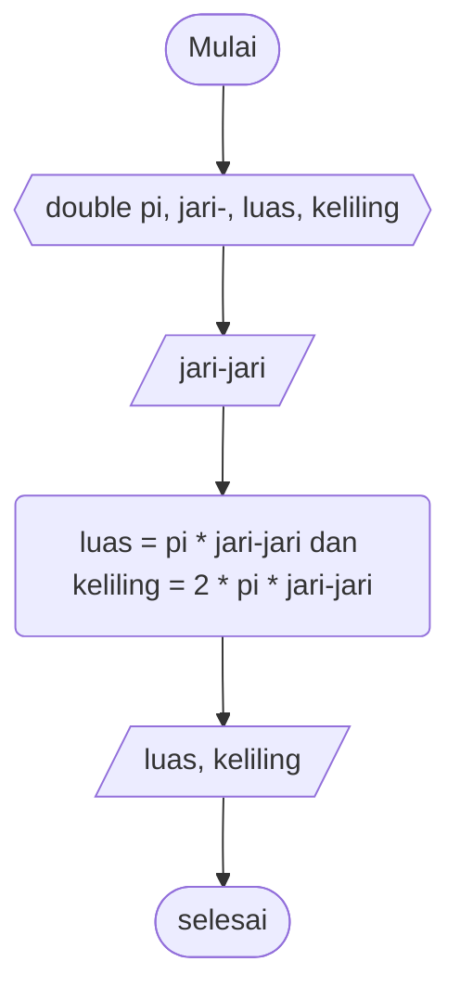

# Pseudocode Luas dan Keliling Lingkaran #

Deklarasi double pi, jari-jari, luas, keliling\
input nilai pi = 3.14

print "nilai jari-jari"\
input nilai jari-jari

luas = pi * jari-jari * jari jari\
keliling = 2 * pi * jari-jari

print "luas" dan "keliling"

# Flowchart Luas dan Keliling Persegi Lingkaran #

