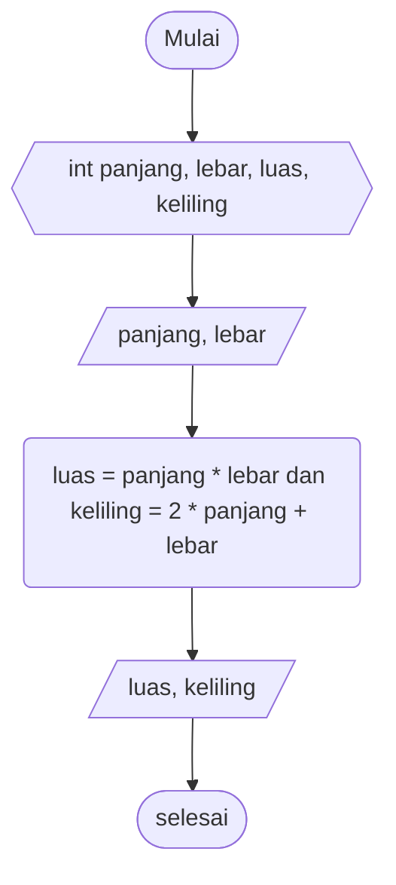

# Pseudocode Luas dan Keliling Persegi Panjang #

Deklarasi int panjang, lebar, luas, keliling

print "nilai panjang"\
input nilai panjang\
print "nilai lebar"\
input nilai lebar

luas = panjang * lebar\
keliling = 2 * panjang + lebar

print "luas" dan "keliling

# Flowchart Luas Persegi Panjang #

