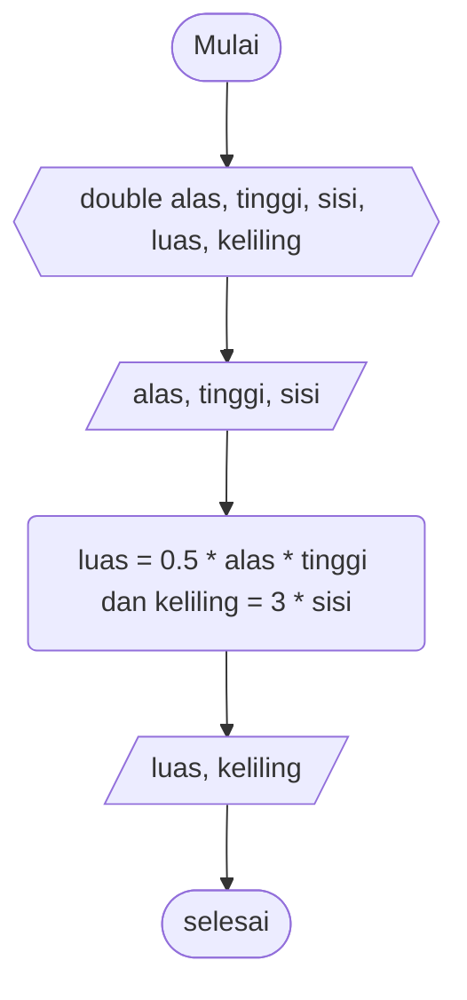

# Pseudocode Luas Segitiga #

Deklarasi double alas, tinggi, sisi, luas, keliling

print "alas"\
input nilai alas
print "tinggi"
input nilai tinggi

luas = 0.5 * alas * tinggi
keliling = sisi * 3

print "luas" dan "keliling"

# Flowchart Luas dan Keliling Segitiga #

