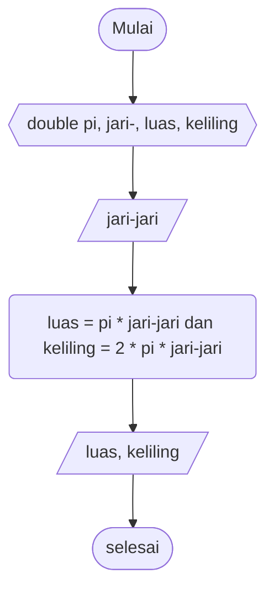

# Pseudocode Luas dan Keliling Persegi Panjang #

Deklarasi int panjang, lebar, luas, keliling

print "nilai panjang"\
input nilai panjang\
print "nilai lebar"\
input nilai lebar

luas = panjang * lebar\
keliling = 2 * panjang + lebar

print "luas" dan "keliling

# Flowchart Luas Persegi Panjang #

# Pseudocode Luas dan Keliling Lingkaran #

Deklarasi double pi, jari-jari, luas, keliling\
input nilai pi = 3.14

print "nilai jari-jari"\
input nilai jari-jari

luas = pi * jari-jari * jari jari\
keliling = 2 * pi * jari-jari

print "luas" dan "keliling"

# Flowchart Luas dan Keliling Persegi Lingkaran #

# Pseudocode Luas Segitiga #

Deklarasi double alas, tinggi, sisi, luas, keliling

print "alas"\
input nilai alas
print "tinggi"
input nilai tinggi

luas = 0.5 * alas * tinggi
keliling = sisi * 3

print "luas" dan "keliling"

# Flowchart Luas dan Keliling Segitiga #

