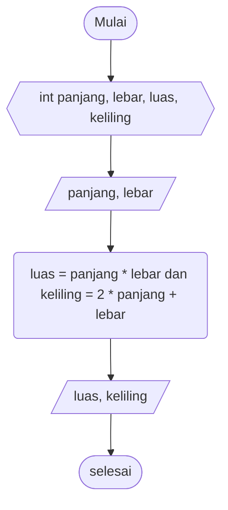
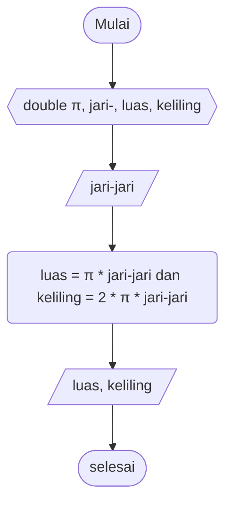
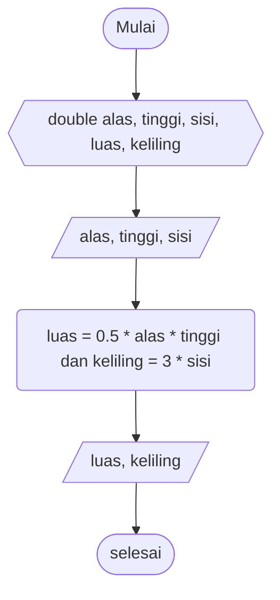

# Pseudocode Luas dan Keliling Persegi Panjang #

Deklarasi int panjang, lebar, luas, keliling

print "nilai panjang"\
input nilai panjang\
print "nilai lebar"\
input nilai lebar

luas = panjang * lebar\
keliling = 2 * panjang + lebar

print "luas" dan "keliling

# Flowchart Luas dan Keliling Persegi Panjang #

# Code Java Luas dan Keliling Persegi Panjang #
    import java.util.Scanner;

    public class PersegiPanjang {
        public static void main(String[] args) {

            Scanner input = new Scanner(System.in);

            int panjang, lebar, luas, keliling;

            System.out.println("Masukkan Nilai Panjang");
            panjang=input.nextInt();
            System.out.println("\nMasukkan Nilai Lebar");
            lebar=input.nextInt();

            luas= panjang * lebar;
            keliling= 2 * panjang + lebar;

            System.out.println("\nHasil Luas Adalah = " +luas);
            System.out.println("Hasil Keliling Adalah = " +keliling);
        }
    }

# Pseudocode Luas dan Keliling Lingkaran #

Deklarasi double π, jari-jari, luas, keliling\
input nilai π = 3.14

print "nilai jari-jari"\
input nilai jari-jari

luas = π * jari-jari * jari jari\
keliling = 2 * π * jari-jari

print "luas" dan "keliling"

# Flowchart Luas dan Keliling Lingkaran #

# Code Java Luas dan Keliling Lingkaran #

    import java.util.Scanner;

    public class Lingkaran {
        public static void main(String[] args){
        
            Scanner input = new Scanner(System.in);
        
            double jari_jari, luas, keliling;
            double π = 3.14;

            System.out.println("Masukkan Nilai Jari-Jari");
            jari_jari=input.nextDouble();
        
            luas = π * jari_jari * jari_jari;
            keliling = 2 * π * jari_jari;

            System.out.println("\nHasil Luas Adalah = " +luas);
            System.out.println("Hasil Keliling Adalah = " +keliling);
        }
    }

# Pseudocode Luas dan Keliling Segitiga #

Deklarasi double alas, tinggi, sisi, luas, keliling

print "alas"\
input nilai alas
print "tinggi"
input nilai tinggi

luas = 0.5 * alas * tinggi
keliling = sisi * 3

print "luas" dan "keliling"

# Flowchart Luas dan Keliling Segitiga #

# Code Java Luas dan Keliling Segitiga #

    import java.util.Scanner;

    public class Segitiga {
        public static void main(String[] args){

            Scanner input = new Scanner(System.in);
        
            double alas, tinggi, sisi, luas, keliling;

            System.out.println("Masukkan Nilai Alas");
            alas=input.nextDouble();
            System.out.println("Masukkan Nilai Tinggi");
            tinggi=input.nextDouble();
            System.out.println("Masukkan Nilai Sisi");
            sisi=input.nextDouble();
        
            luas = 0.5 * alas * tinggi;
            keliling = sisi * 3;

            System.out.println("\nHasil Luas Adalah = " +luas);
            System.out.println("Hasil Keliling Adalah = " +keliling);
        }
    }
